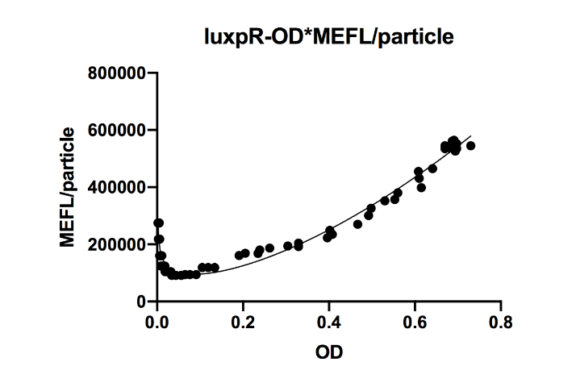

```{r}
no <- c(1,2,3)
team_name <- c("TU Kaiserlautern","Leiden","Fudan")
project_title <- c("Chlamy Yummy - Revolutionizing plastic degradation by introducing Chlamydonmonas reinhardtii as a eukaryotic secretion platform","Rapidemic: A novel modular point-of-care diagnostic tool for rapid edipemic response","ALTER")
project_year <- c(2019, 2020, 2019)
wiki_page <- c("https://2019.igem.org/Team:TU_Kaiserslautern","https://2020.igem.org/Team:Leiden","https://2019.igem.org/Team:Fudan")

igem_team <- data.frame(no, team_name, project_title, project_year, wiki_page)
knitr::kable(igem_team)
```

```{r}
no <- c(1,2,3,4,5,6,7,8,9,10,11,12,13,14,15,16,17,18,19,20,21)
part_id <- c("BBa_K3002004","BBa_K3002005","BBa_K3002014","BBa_K3002029","BBa_K3002037","BBa_K3002018","BBa_K3002028","BBa_K3002010","BBa_K3002017","BBa_K3245001","BBa_K3245002","BBa_K3245003","BBa_K3245004","BBa_K3245005","BBa_K3245006","BBa_K3245007","BBa_K3245008","BBa_K3245009","BBa_K3245011","BBa_K3245012","BBa_K3245013")
part_name <- c("Wildtype PETase for Chlamydomonas reinhardtii (Phytobrick)",
               "Wildtype MHETase for Chlamydomonas reinhardtii Part 1 (Phytobrick)",
               "Mutant PETase for Chlamydomonas reinhardtii (Phytobrick)",
               "Wildtype MHETase for Chlamydomonas reinhardtii Part 2 (Phytobrick)",
               "Wildtype MHETase for Chlamydomonas reinhardtii (Phytobrick)",
               "Sp20 8xHis tag for Chlamydomonas reinhardtii (Phytobrick)",
               "6xHis tag for Chlamydomonas reinhardtii (Phytobrick)",
               "Sp20 HA tag for Chlamydomonas reinhardtii (Phytobrick)",
               "3xHA tag for Chlamydomonas reinhardtii (Phytobrick)",
               "Enhanced QS promoter regulated by luxR-AHL complex",
               "Final dimeric production regulating luxpr",
               "Using homologous recombination to knockout the hns sequence for Nissle1917",
               "Signaling part constructed to express tetR under the control of quorum sensing promoter luxpR",
               "Signaling part constructed to express tetR under the control of quorum sensing promoter luxpR",
               "Signaling part constructed to express tetR under the control of quorum sensing promoter luxpR",
               "Part constructed to characteriza part R0040",
               "Enhanced sfGFP, carrying multiple mutants from E0040",
               "Enhanced QS promoter regulated by luxR-AHL complex",
               "Part constructed to characterize part R0040",
               "Part constructed to characteriza part R0041",
               "TetR regulated reporter that constitutively expresses GFP when not repressed by tetR")
part_type <- c("Coding","Coding","Coding","Coding","Coding","Tag","Tag","Tag","Tag","Regulatory","Regulatory","Temporary","signaling","signaling","signaling","composite","coding","Regulatory","composite","composite","Coding")
team_id <- c(1,1,1,1,1,1,1,1,1,3,3,3,3,3,3,3,3,3,3,3,3)

igem_part <- data.frame (no, part_id, part_name, part_type, team_id)
knitr::kable(igem_part)
```

# Applications of BBa_R0062

## 2019 Fudan iGEM Team

### Information of BBa_R0062

-   Promoter (luxR & HSL regulated -- lux pR)

-   Promoter activated by LuxR in concert with HSL

The lux cassette of V. fischeri contains a left and a right promoter. The right promoter gives weak constitutive expression of downstream genes.This expression is up-regulated by the action of the LuxR activator protein complexed with the autoinducer, 3-oxo-hexanoyl-HSL.

Two molecules of LuxR protein form a complex with two molecules of the signalling compound homoserine lactone (HSL). This complex binds to a palindromic site on the promoter, increasing the rate of transcription.

This Plux promoter "pointing to the right" is the same sequence, but inverted, as part BBa_K199052

Usage and Biology

:   Pretty good off in the absence of LuxR/HSL. [jb, 5/24/04] The team from Davidson College and Missouri Western State University discovered that this part promotes "backwards transcription" when LuxR protein is present and AHL-3OC6 is absent.

### Background

In our project, we hope that this promoter will trigger the regulation of the downstream circuit. Since we use the production of its upstream regulating genes luxI and luxR as its signal in our final circuit, our measurement continued this design and measure the curve basing on OD value. Data collected in unit of the concentration of bacteria will directly reflect if the system works properly.

### Experiment design and measurement

To test the part's function, DH10B was transferred with plasmids carrying the promoter with another LuxI-LuxR (BBa_K3245002) plasmid at the same time. They added GFP after luxpR as the reporter of its expression level. By measuring fluorescence/OD600, the expressing level can be known.

As it reached a high concentration, luxpR became activated.

{width="356"}

### Design

We substituted the -35 to -10 region of the original promoter luxpR with the one of J23100, a strong constitutive promoter. This region is rarely concerned as it's rather conservative in promoters with the same function, but it has crucial structural effect on σ factor binding and other events in transcription regulation. Fortunately the change proved to be effective on adjusting the behavior of the regulatory promoter
.png "Fudan 2019 design"){width="389"}

### Experiment condition

-   We cultured the bacteria mentioned above overnight.

-   As it reached a high concentration, luxpR became activated. Then we diluted the culture to 1/5000 and measured its fluorescence and OD600 every 30 minutes.

```{r}
no <- c(1,2,3,4)
step <- c("Inoculation","Dilution","Incubation","Measure")
culture_volume <- c("3 ml","15 ml (1/5000)"," ","200 μl")
culture_temperature <- c("37","" ,"37","")
culture_time <- c("overnight","","15 hours","every 30 minutes")

protocol <- data.frame (no, step, culture_volume, culture_temperature, culture_time)
knitr::kable(protocol)
```

### Result

{width="432"}

-   luxpR-fus100 has a higher expression level and luxpR-HS100 has low leakage at the cost of a lower expression level.
