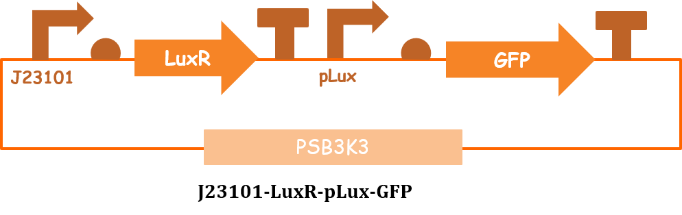

```{r}
library(tidyverse)


igem_team1 <- data.frame(id="1", 
                        team_name="iBowu-China", 
                        project = "Biocontrol of Soft Rot", 
                        year = "2019", 
                        wiki = "https://2019.igem.org/Team:iBowu-China")

igem_team2 <- data.frame(id = "1",
             team_name = "OUC-China",
             project = "Logitch: Logic Gates and RNA Switch",
             year = "2020",
             wiki = "https://2020.igem.org/Team:OUC-China")

bind_rows(igem_team1, igem_team2)

```

{width="474"}

# iBowu-China
# BBa_K3225015 : J23101-LuxR-pLux-LacZ

```{r}
id <- 1:7
BBid <- c("BBa_J23101","BBa_B0034","BBa_C0062","BBa_B0015", "BBa_R0062", "BBa_I732017","BBa_B0015")
type <- c("promoter", "RBS","regulatory","terminator", "promoter", "coding","terminator")
link <- c("http://parts.igem.org/Part:BBa_J23101",
           "http://parts.igem.org/Part:BBa_B0034",
           "http://parts.igem.org/Part:BBa_C0062",
           "http://parts.igem.org/Part:BBa_B0015",
          "http://parts.igem.org/Part:BBa_R0062",
          "http://parts.igem.org/Part:BBa_I732017",
          "http://parts.igem.org/Part:BBa_B0015")
backbone <- rep("PSB3K3", length(id))
device_id <- paste0("D", sprintf("%04d", rep(1, length(id))) )
team_name <- rep("iBowu-China", length(id))
user <- rep("JinjuLee119", length(id))

igem_part <- data.frame(id, BBid, type, link, backbone, device_id, team_name, user)
knitr::kable(igem_part)
```

## Results in vivo

```{r}
id <- c(1:4)
strain <- rep("E.coli", length(id))
indc <- rep("OHHL", length(id))
conc <- c(0, 1, 10, 100)
value <- c(10000, 14000, 15500, 15500)
valunit <- rep("Fluorescence intensity", length(id))
incubhr <- rep("100 minutes", length(id))
incubtemp <- rep("37 ℃", length(id))
device_id <- rep("D0001", length(id))
link <- c("http://parts.igem.org/Part:BBa_R0062",length(id))

igem_obs <- data.frame(id, strain, indc, conc, value,
                        valunit, incubhr, incubtemp,
                       device_id, link)
knitr::kable(igem_obs)
```

## Results in vitro (cell-free system)

```{r}
id <- c(1:6)
indc <- rep("AHL", length(id))
conc <- c(0.1, 1, 10, 100,500,1000)
value <- c(10,100,200000,300000,400000,350000)
valunit <- rep("FLU", length(id))
incubhr <- rep("overnight", length(id))
incubtemp <- rep("37 ℃", length(id))
device_id <- rep("D0001", length(id))
link <- c("https://2019.igem.org/Team:iBowu-China/Demonstrate#ResultCellFree",length(id))

igem_obs_2 <- data.frame(id, indc, conc, value,
                        valunit, incubhr, incubtemp,
                       device_id, link)
knitr::kable(igem_obs_2)
```

```{r}
library(tidyverse)
igem_promoter <- igem_part %>%
  left_join(igem_team1, by="team_name") %>%
  left_join(igem_obs_2, by="device_id")

knitr::kable(igem_promoter)

plot_data <- igem_promoter %>%
  filter(BBid=="BBa_R0062") %>%
  select(indc, conc, value) %>%
  mutate(indc=factor(indc),conc=factor(conc))

ggplot(plot_data, aes(x=conc, y=value, fill=conc))+
  geom_bar(stat="identity", position=position_dodge(width=0.5), width=0.4)+
  theme_bw()
```


# OUC-China
# IMPLY Gate

```{r}
id <- 1:2
BBid <- c("BBa_R0062","BBa_K3328031")
type <- c("Regulatory","Reporter")
link <- c("http://parts.igem.org/Part:BBa_R0062","http://parts.igem.org/Part:BBa_K3328031")
backbone <- rep("-", length(id))
device_id <- paste0("D", sprintf("%04d", rep(1, length(id))))
team_name <- rep("OUC-China", length(id))
user <- rep("JinjuLee119", length(id))

igem_part2 <- data.frame(id, BBid, type, link, backbone, device_id, team_name, user)
knitr::kable(igem_part2)
```

## Results

```{r}
id <- c(1:6)
indc <- rep("HSL", length(id))
conc <- c(0, 0.001, 0.002, 0.01, 0.1, 1)
concunit <- rep("mg/mL",length(id))
value <- c(10, 30, 130, 300, 400, 380)
valunit <- rep("fluorescence(a.u.)", length(id))
incubhr <- rep("10 hours", length(id))
incubtemp <- rep("37 ℃", length(id))
device_id <- rep("D0001", length(id))
link <- c("https://2020.igem.org/Team:OUC-China/Results",length(id))

igem_obs <- data.frame(id, indc, conc, concunit, value, valunit, incubhr, incubtemp, device_id, link)
knitr::kable(igem_obs)
```

```{r}
library(tidyverse)
igem_promoter2 <- igem_part2 %>%
  left_join(igem_team2, by="team_name") %>%
  left_join(igem_obs, by="device_id")

knitr::kable(igem_promoter2)

plot_data <- igem_promoter2 %>%
  filter(BBid=="BBa_R0062") %>%
  select(indc, conc, value) %>%
  mutate(indc=factor(indc),conc=factor(conc))

ggplot(plot_data, aes(x=conc, y=value, fill=conc))+
  geom_bar(stat="identity", position=position_dodge(width=0.5), width=0.4)+
  theme_bw()
```
